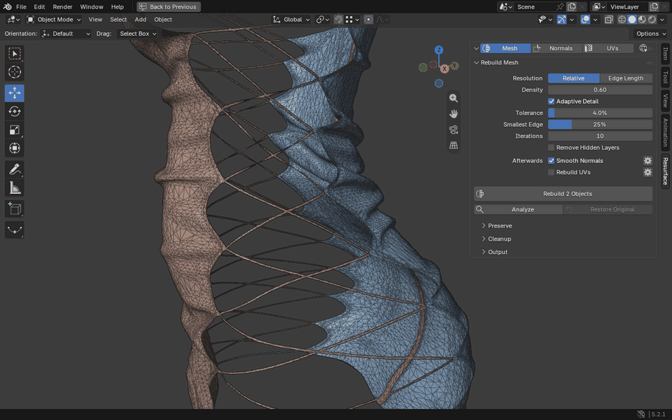
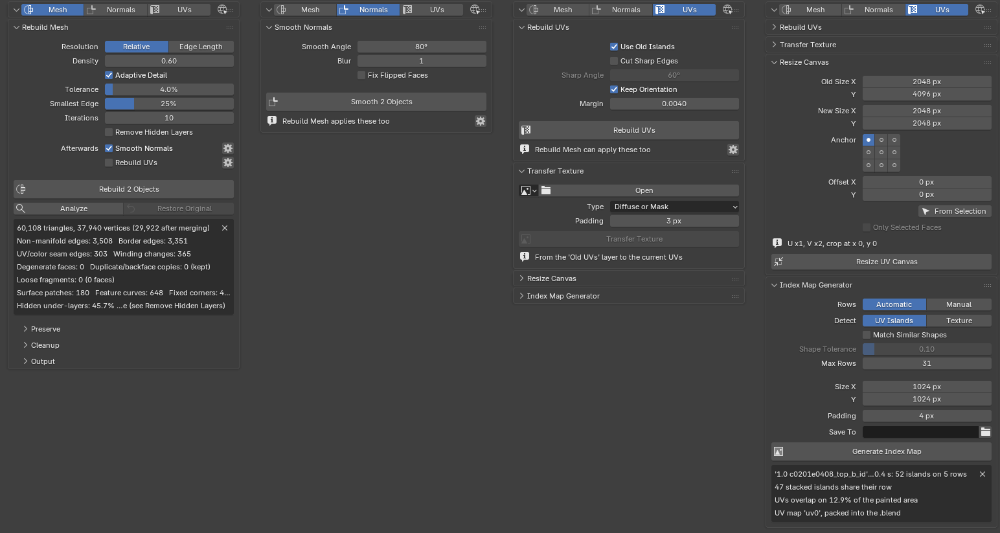
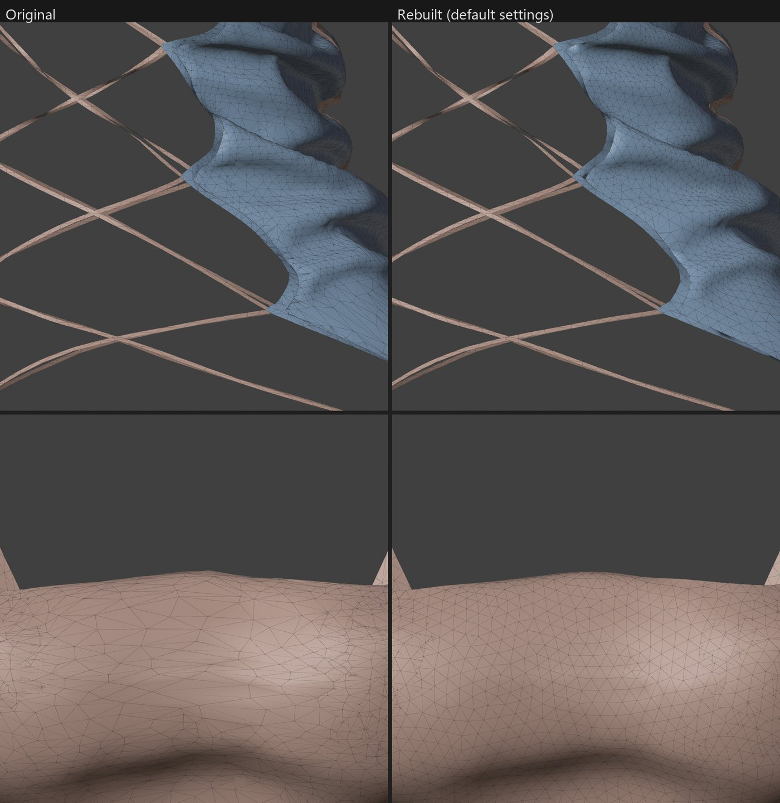

# Resurface

A Blender add-on that rebuilds messy meshes into clean, even triangles without losing thin parts like strings, straps and fringe. Decimated triangle soup, slivers, uneven density and non-manifold junctions all come out as a tidy surface. UVs, weights, shape keys and normals all get preserved. The addon also supports generating repaired, smoothed normals, building new UV layouts, easily rebaking textures to that new layout and generating FFXIV index maps.



This page only gives a brief overview. The [guide](docs/guide.md) covers every tool and setting in detail.

## Requirements

- **Blender 4.2 or newer.** Note: I've personally only tested with Blender 5.2 LTS.
- **For FFXIV models,** an importer and exporter such as [XIV Instant Edit](https://github.com/link-0402/XIV-Instant-Edit) or TexTools to get `.mdl` files in and out of Blender. The texture transfer works on common image formats Blender can open, so export `.tex` files to a format like TGA or PNG first.

## Installation

Add this repository to Blender to automatically install it along with automatic updates:

1. Open **Edit → Preferences → Get Extensions** in Blender.
2. Click **Repositories**, click **+**, and choose **Add Remote Repository**.
3. Add this repository URL:
   ```
   https://raw.githubusercontent.com/link-0402/Resurface/main/blender_repo/index.json
   ```
4. Tick **Check for Updates on Startup** to get new versions automatically.
5. Find **Resurface** in the list and install it.
6. In the 3D Viewport, press **N** and open the **Resurface** tab.

## Features

The tab has three pages: **Mesh**, **Normals** and **UVs**.



### Rebuild Mesh

**[Rebuild Mesh](docs/guide.md#rebuild-mesh)** replaces the mesh of the selected objects with clean, evenly sized triangles. Voxel and quad remeshers lose anything thinner than a voxel or narrower than a quad. Resurface works on the original surface instead: borders, junctions between cloth layers and UV seams stay edges, and a string one triangle wide stays a string. Triangles get smaller where the surface folds tightly.

- UVs, vertex weights, shape keys, colors and normals are carried over. Each object keeps its name, modifiers, vertex groups and materials.
- It runs in the background, with progress in the status bar. **Esc** cancels.
- The original mesh is kept, and **Restore Original** swaps it back.
- **Analyze** reports what's wrong with a mesh. **Remove Hidden Layers** deletes under-layers that can never be seen but might clip through the front mesh on meshes with bad geometry.
- Under **Afterwards**, Rebuild Mesh also runs **Smooth Normals** (on by default) and **Rebuild UVs** on the new mesh.



### Smooth Normals

**[Smooth Normals](docs/guide.md#smooth-normals)** gives any meshes clean smooth normals. On layered game cloth, Blender's *Recalculate Outside* with *Set from Faces* leaves dark spots, seams and pinches where strings meet panels or faces are wound the other way. Smooth Normals never flips faces, so what you see from outside and from inside stays the same.

### UV tools

The UVs page has four tools:

- **[Rebuild UVs](docs/guide.md#rebuild-uvs)** makes a clean layout without overlaps and with even texel density. Seams follow the model's structure (the old islands, layer junctions, part borders) instead of every wrinkle, and each island keeps its old orientation. The previous UVs stay in a layer named **Old UVs**.
- **[Transfer Texture](docs/guide.md#transfer-texture)** moves a texture painted for the old UVs onto the new layout. It handles diffuse maps and masks, `_id` index maps (never blended) and normal maps (turned with each island).
- **[Resize Canvas](docs/guide.md#resize-canvas)** moves UVs after a texture's canvas was cropped or extended in an image editor (from 2048×4096 to 2048×2048, say), so every face keeps showing the same pixels.
- **[Index Map Generator](docs/guide.md#index-map-generator)** paints the `_id` texture for Dawntrail colorsets. It hands out the rows by UV island or by the colours of the base texture, or you assign them to faces by hand in Edit Mode.

## Good to know

- **Rebuild parts that touch together.** Select all of them, so their shared edges stay aligned.
- **For hair and hand-edited normals,** switch off *Afterwards: Smooth Normals*. The original normals are then carried over instead.
- **Keep Remove Hidden Layers off for see-through textures** such as lace or mesh fabric, because the layer below shows through the holes.
- **The original mesh stays in the .blend** (as *<mesh> (original)*) until you click **Discard Original** under *Output*.
- **Ready for export:** the result is all triangles, which the MDL exporter needs. XIV Instant Edit ignores the **Old UVs** layer and the index map rows (`colorset_row`).

## Credits

- **Remeshing** follows *A Remeshing Approach to Multiresolution Modeling* by Mario Botsch and Leif Kobbelt (2004) and *Adaptive Remeshing for Real-Time Mesh Deformation* by Marion Dunyach et al. (2013), extended for non-manifold, layered game meshes.
- **Rebuild UVs** uses Blender's own *Minimum Stretch* unwrapper and island packing.

## License

Resurface is licensed under the [GNU General Public License v3.0 or later](resurface/LICENSE).

## Links

[XIV Mod Archive](https://www.xivmodarchive.com/user/124593) · [GitHub](https://github.com/link-0402/Resurface) · [Bluesky](https://bsky.app/profile/xiv-luci.bsky.social) · [Ko-fi](https://ko-fi.com/luci_xiv)
