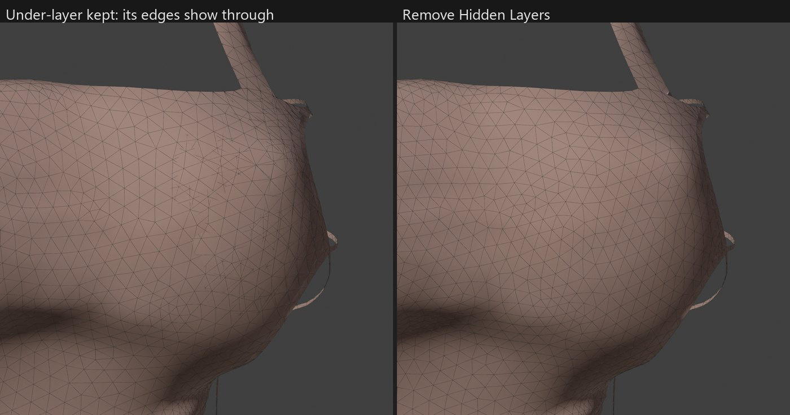

# Resurface guide

Every tool and setting in detail. For an overview, installation and credits, see the [README](../README.md).

- [The sidebar](#the-sidebar)
- [Rebuild Mesh](#rebuild-mesh)
- [Smooth Normals](#smooth-normals)
- [Rebuild UVs](#rebuild-uvs)
- [Transfer Texture](#transfer-texture)
- [Resize Canvas](#resize-canvas)
- [Index Map Generator](#index-map-generator)
- [For developers](#for-developers)

## The sidebar

Press **N** in the 3D Viewport and open the **Resurface** tab. Its three pages:

| Page | Tools |
|---|---|
| **Mesh** | Rebuild Mesh, Analyze, Restore Original / Discard Original |
| **Normals** | Smooth Normals |
| **UVs** | Rebuild UVs, Transfer Texture, Resize Canvas, Index Map Generator |

Each tool shows its last result in a box in its own panel; the **×** hides it. The gear buttons jump to the page whose settings a switch uses.

## Rebuild Mesh

### Use

1. In Object Mode, select the mesh parts to rebuild. Select all parts that touch each other, so their shared edges stay aligned.
2. Optional: **Analyze** reports what's wrong with the mesh (non-manifold edges, seams, winding changes, hidden under-layers…).
3. Under **Afterwards**, **Smooth Normals** is on. Switch it off for hair or anything with hand-edited normals. Switch on **Rebuild UVs** if you want a new UV layout too.
4. Click **Rebuild**. The job runs in the background with progress in the status bar. **Esc** cancels, and nothing changes until the meshes are written.

Each object keeps its name, modifiers, custom properties, vertex groups and material slots; only its mesh data is replaced. With **Keep Original** (on by default) the old mesh stays in the .blend as *<mesh> (original)*, **Restore Original** swaps it back and **Discard Original** deletes it. Rebuilding a rebuilt object again keeps the first original.

### Settings

| Setting | What it does |
|---|---|
| **Resolution** | *Relative*: **Density** 1.0 aims at the input's triangle count, lower is coarser (default 0.6). *Edge Length*: a fixed base edge length. |
| **Adaptive Detail**, **Tolerance** | Use smaller triangles where the new surface would deviate from the original by more than *Tolerance* (percent of the base edge length), such as wrinkle crests and tight folds. |
| **Smallest Edge** | Adaptive refinement never goes below this share of the base edge length, nor finer than the input's own triangles there. |
| **Iterations** | Remeshing passes. 10 is plenty for most meshes. |
| **Remove Hidden Layers** | Delete under-layers that can never be seen (see [Hidden layers](#hidden-layers)). Off by default. |
| **Afterwards: Smooth Normals** | Recompute the normals with the Normals page. Off: the input normals are carried over. |
| **Afterwards: Rebuild UVs** | Make a new UV layout with the UVs page. Off: the input layout is carried over unchanged. |
| *Preserve:* **UV Seams**, **Color Seams** | Keep seams as edges, so UVs and colors transfer exactly. |
| *Preserve:* **Sharp Edges**, **Sharp Angle** | Keep creases as edges. For hard-surface models; leave off for cloth. |
| *Preserve:* **Seam Threshold** | UV or color differences below this aren't seams (0.002 is about 1 pixel on a 512 texture). Decimators leave many sub-pixel UV splits that would otherwise pin vertices. |
| *Preserve:* **Ignore Tiny Features** | Dissolve seam and crease fragments smaller than the new triangles, and flip small patches wound the wrong way. Real UV island borders stay. |
| *Preserve:* **Corner Angle** | Border and seam points that turn sharper than this stay fixed. |
| *Cleanup:* **Layer Gap** | Largest distance between a shell and the hidden layer under it. 0 = 1% of the selection's size. |
| *Cleanup:* **Merge Distance** | Vertices closer than this count as one. Also used by Smooth Normals, Rebuild UVs and the Index Map Generator. |
| *Cleanup:* **Remove Fragments** | Delete loose pieces with at most this many triangles and practically no area. |
| *Output:* **Max Weights** | Limit bone influences per vertex (0 = like the input). |
| *Output:* **Keep Original** | Keep the old mesh so it can be restored. |

Borders and non-manifold junctions are always kept.

On the test dress, the defaults give about the input's triangle count (60k in, 61k out) in about 12 seconds, with a median triangle quality of 0.97 (1.0 is equilateral). 99% of the original surface lies within about 0.4 mm of the result.

### How it works

1. **Heal:** merge split vertices, remove degenerate faces and zero-area debris. The author's face orientation is kept; only tiny flipped slivers are fixed.
2. **Find features:** borders, non-manifold junctions (where the outer cloth, the lining and a seam flange meet), UV and color seams, borders between the selected objects, winding changes and, optionally, sharp creases become *feature curves*. They split the surface into *patches*.
3. **Remesh:** adaptive isotropic remeshing (split, collapse, flip, relax, project). Feature curves are resampled but never lost. Vertices are tracked on the surface of their own patch, so they can't jump to a nearby layer. An edge that would join two different curves across a strip is never collapsed, so thin strips survive.
4. **Adapt:** where the new surface deviates from the original by more than the tolerance, triangles get smaller.
5. **Transfer:** every new corner is located on the original surface, on the right side of every seam, and UVs, colors, normals, weights, shape keys and other attributes are interpolated from there.

### Hidden layers

Some models carry a second copy of a surface a few millimetres under the visible one, facing the same way, usually from simulated cloth thickness or duplicated panels. On the test dress, 46% of the surface is such an under-layer (the front panel, both back halves and the straps). It can never be seen: from outside the shell covers it, and from inside it's a back face. It still costs triangles, and in Edit Mode its edges show through the shell.

**Analyze** reports these layers, and **Rebuild** prints a tip when it finds them. With **Remove Hidden Layers** on, they're deleted before rebuilding. The decision is made per patch, so a string or strap crossing a panel never punches a hole. Where the under-layer stuck out past the shell's edge (by about a millimetre on the dress's scalloped rims), that sliver goes too.

Keep it off when the outer layer uses see-through textures (lace, mesh fabric), because the layer below shows through the holes. After removal, the old junction line is marked sharp to keep the original's split normals there.



### Notes

- **Backface copies** (parts made by Instant Edit's *Generate Duplicate with Backfaces*, or any exact duplicate faces) are rebuilt on the new surface in their own object, with their own UVs and flipped winding.
- **Fixed corners:** very noisy feature networks, such as a junction line that a decimator broke into dashes, leave a few fixed points. The triangles right next to them are the only ones that can stay thin.

## Smooth Normals

On the **Normals** page. It works on any selected meshes, rebuilt or not, and processes them together. Rebuild Mesh uses it when *Afterwards: Smooth Normals* is on.

*Recalculate Outside* + *Set from Faces* often fails on game cloth. Strings, straps and seam strips meet the panels at non-manifold junctions, and some regions are wound the other way, so the average mixes faces of different sheets or cancels them out. Smooth Normals instead:

- welds vertices by position, so UV seams and part borders don't show in the shading;
- groups the faces around each vertex. Faces join across an edge when their angle is below **Smooth Angle**, measured after aligning faces that are wound the other way;
- averages each group, weighted by corner angles;
- optionally blurs the result (**Blur** passes) to soften lumpy, decimated surfaces. Hard edges are never blurred across.

It never changes face winding, so what is visible from outside and from inside stays exactly the same. **Fix Flipped Faces** (off by default) also flips tiny stray groups of faces wound against their surroundings. Larger inward-facing regions, like seam allowances or the insides of straps, are usually meant to be seen from inside and are left alone.

## Rebuild UVs

On the **UVs** page. It replaces the UVs of the selected meshes with a clean layout without overlaps. The previous UVs are kept in a layer named **Old UVs**, which Transfer Texture reads and the MDL exporter ignores. Delete it once you no longer need it.

Smart UV Project cuts by face angle, so on ruched cloth every wrinkle becomes a seam. Plain Unwrap needs seams, and a rebuilt mesh is welded into one surface. Rebuild UVs places the seams from the model's structure:

1. **Seams** along the old UV island borders (**Use Old Islands**; usually the original pattern pieces, whose outline is fine even when their layout isn't), along junctions of three or more sheets, borders between parts or materials and winding changes. **Cut Sharp Edges** adds creases sharper than its **Sharp Angle**.
2. **Disk shapes:** rings and tubes get the shortest cut joining their borders, closed pieces get a slit, and anything else that can't be flattened is split until it can.
3. **Unwrap** with Blender's *Minimum Stretch* unwrapper, then cut narrow bridges the first unwrap reveals, and split thin strips far longer than the panels so they pack well.
4. **Pack** with equal texel density and **Margin** between islands. With **Keep Orientation**, each island is turned the way it was in the old UVs and packed without rotating, which keeps textures and normal maps easy to transfer.

On the test dress, 55 overlapping islands using 20% of the texture (12.9% of it claimed twice) become 97 islands using 50%, with no overlap.

## Transfer Texture

On the UVs page, under Rebuild UVs. It moves a texture painted for the old UVs (the **Old UVs** layer) onto the current layout, and saves `<name>_newuv.png` next to the original file.

- **Diffuse or Mask:** smooth (bilinear) resampling.
- **Index / ID:** nearest resampling, so `_id` colorset indices are never blended.
- **Normal Map:** R and G (the tangent direction) are turned with each island; B and A, which FFXIV uses for other data, are copied unchanged. **Green Points Down** is for DirectX-style maps and only matters for turned islands.
- **Padding:** pixels added around each island so filtering doesn't pull in the background.

Export the textures from Penumbra or TexTools as PNG, transfer them, and import the results back as `.tex`.

## Resize Canvas

On the UVs page. When a texture's canvas was cropped or extended in an image editor, its pixels didn't change, they only moved. This tool moves the active UV map the same way, so every face keeps showing the same pixels.

1. **Old Size** and **New Size**: the texture before and after, in pixels.
2. **Anchor**: where the new canvas sits on the old one. Use the same anchor as in the image editor's canvas size dialog.
3. **Offset** (optional): an extra shift in pixels, right and down. With the top-left anchor, it's the top-left corner of a crop rectangle. **From Selection** sets it to the top-left corner of the selected UVs.
4. **Resize UV Canvas.** In Edit Mode, **Only Selected Faces** limits it to the selection; otherwise whole meshes change.

The line above the button shows the resulting scale and crop position. It's exact for any anchor or offset and works on several objects at once, in Object and Edit Mode.

## Index Map Generator

On the UVs page. It paints an FFXIV index (`_id`) texture for Dawntrail colorsets from the active UV map of the selected meshes (or the ones in Edit Mode). Red selects the row pair (`00`, `11`, … `FF` for pairs 1–16), green selects row A (`FF`) or B (`00`). Texture that no face covers is black, which reads as row 1B.

**Rows:**

- **Automatic:** the rows are found for you and handed out by area, largest first (1A, 2A, 2B, 3A, … 16B). **Detect** chooses what they're based on (below). **Max Rows** caps the count; when more are found, the most alike share a row (the closest colours, or the islands most similar in shape and size).
- **Manual:** in Edit Mode, select faces, pick a row and **Assign** (or **Remove**). The list shows the rows in use with their colours and face counts; its buttons select or clear a row. **Fill Unassigned** gives every face without a row the row Automatic would give it, as a starting point. Faces without a row are painted as 1B.

**Output:** **Size**, **Padding** (pixels added around each island so filtering and mip maps don't pull in the background) and **Save To** (a PNG file or folder; empty keeps the image packed in the .blend). Running it again updates the same image, so a material that shows it updates too.

### Detect: UV Islands

Needs nothing but the mesh: every UV island gets its own row. Islands are found on the welded surface, so a game mesh split along hard edges isn't cut into extra islands. Islands stacked on the same texture area (mirrored halves, duplicated layers) always share a row, because the texture can't tell them apart. **Match Similar Shapes** also gives islands of the same shape and size one row (within **Shape Tolerance**), such as left and right pieces laid out side by side.

### Detect: Texture

Reads the base colour texture (`_base` or `_d`, as PNG) painted for the active UV map and gives every region of one colour its own row, also inside an island. A panel with painted trim, straps or a logo is split along the painted edges, and the same colour on different islands shares a row. Only texels the UV layout uses count.

- **Color Tolerance** (CIE ΔE; about 2 is barely visible, 10 clearly different): colours closer than this share a row. Lower it to split close shades, raise it to join them.
- **Detail Size** (percent of the texture): print, stitching, grime and lines smaller or thinner than this join the area around them.
- **Whole Islands:** every island takes the row of its main colour instead of being split. Islands of the same colour still share a row.
- Baked shading is recognised: where one colour fades into another gradually, both sides stay one row. See-through texels (alpha below 50%, such as holes in lace) take the row around them.

The result box lists every row with the average colour of its area and its share of the texture (`1A #9F7269 32%`), so you can tell which row is which when you set up the colorset. The texture is analysed at up to 1024 px; a larger index map is scaled from that, with exact island borders. It takes a few seconds per 2048 px texture.

### Where rows are stored

Manual rows are stored per face in an integer attribute named `colorset_row`. It survives Rebuild Mesh, joining and separating, and the MDL exporter ignores it. The older *XIV Index Map Generator* script stored rows in `UV_Group…` vertex groups, which Instant Edit exports as bones. When such groups are present, the panel offers **Convert Old Row Groups**, which turns them into face rows and deletes the groups.

### Code layout

The add-on only uses NumPy and Blender's own modules.

```
resurface/
  __init__.py, props.py, operators.py, ui.py   add-on registration, settings, operators, sidebar
  uvtools.py                                   Resize Canvas and Index Map Generator operators
  pipeline.py                                  the step-wise rebuild job
  blender_io.py                                reading meshes and writing results
  core/source.py                               healing, features, patches, chains
  core/remesh.py                               the remesher
  core/transfer.py                             locating corners on the source surface
  core/normals.py                              smooth normals and flipped-face detection
  core/uvseams.py                              seam placement for Rebuild UVs
  core/texremap.py                             moving textures between UV layouts
  core/canvas.py                               UV mapping for a cropped or extended canvas
  core/indexmap.py                             UV islands, texture colour regions, rows, rasterizing
  core/geom.py                                 numpy geometry kernels
```
